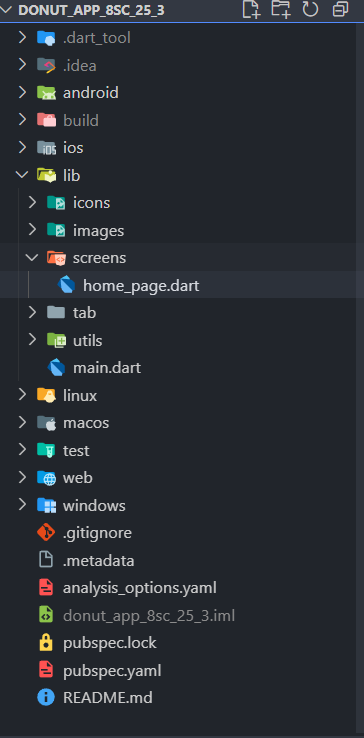
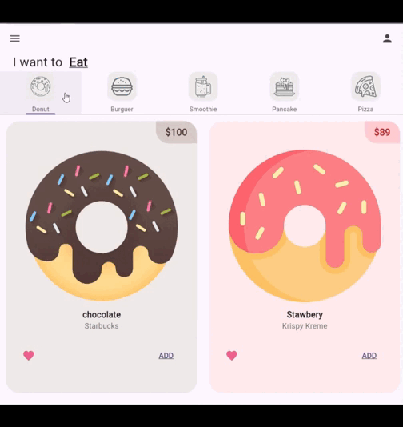

# 🍩 donut_app_8sc_25_3

Welcome to **donut_app**, a modern mobile interface built using **Flutter** and **Dart**, designed to showcase a clean and delightful donut-themed user experience. The project focuses on layout design, navigation, and UI consistency inspired by professional app templates.

## 📚 Course Info

- Course Name: Mobile Application Programming

-CREATED BY : JAIR DAVID CANUL SERRALTA

- Instructor: Rodrigo Fidel Gaxiola Sosa

## 💻 Technologies Used  

- [Flutter](https://flutter.dev/)  
- [Dart](https://dart.dev/)    
- [Visual Studio Code](https://code.visualstudio.com/)  

## 🧩 Main Widgets Summary  

- **MaterialApp** → Acts as the root of the app, defining routes, navigation, and theming. 🎨  
- **HomePage (StatefulWidget)** → The central dynamic page that updates its content based on user interaction. 🔁  
- **Scaffold** → Provides the basic visual framework, including the structure for the AppBar and main body. 🧱  
- **AppBar** → Displays the top toolbar with menu and profile icons for easy access. 📍  
- **Column** → Arranges the main UI elements vertically such as titles, categories, and previews. 📑  
- **Icon** → Represents key visual actions and helps users navigate through the app. 🖼️  

## 📂 Project Structure  

- **Main Folder:** `donut_app` 🍩  
- **Source Code:** `lib/` 📁  
- **Main File:** `main.dart` 🧠  
- **Home Screen:** `screens/home_page.dart` 🏠  
- **Configuration File:** `pubspec.yaml` 📜  

## 🎬 Demo Aplication

## 🧃 *Current Development Stage:*  
The user interface has been successfully built and styled. Functionalities such as navigation, data handling, or state management will be added in upcoming updates. 🚧  

## 🎨 Credits

- Original UI concept inspired by a **Dribbble** design.  
Check out the original idea here: [Dribbble – App UI Design](https://dribbble.com/shots/19649140-App-UI) 🎨